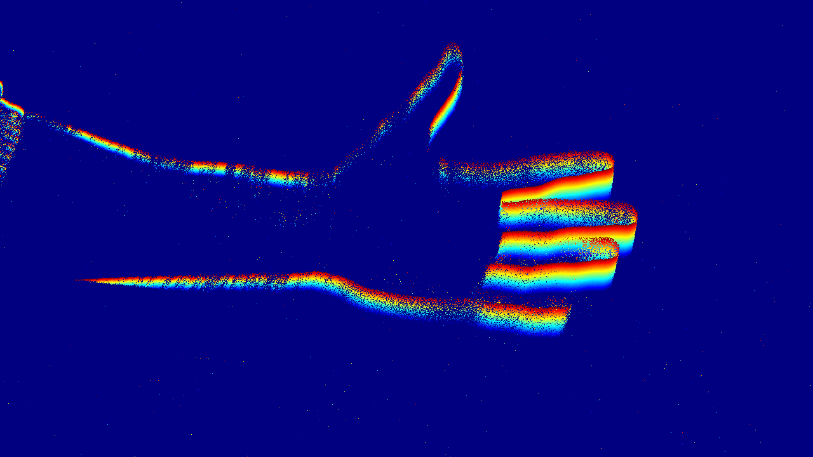
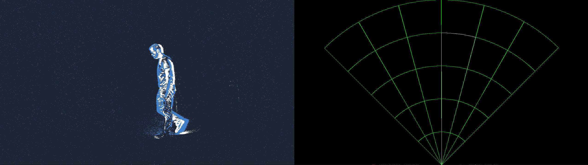
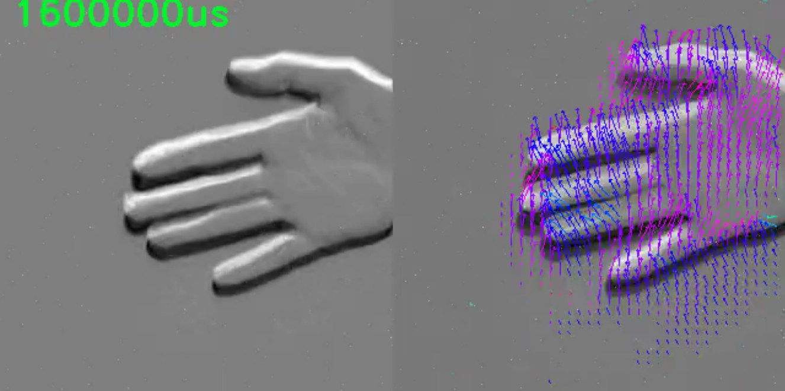

# Getting started with Metavision
Easy examples for event processing compatible with Prophesee **Metavision SDK 5.0 - 5.2**.

This repository provides a few C++ and Python examples demonstrating ways to retrieve events from a recording or a live
camera and process them to do visualization, processing, or AI. It is designed to streamline the integration of event-based
data into your programming workflows, to develop POCs, or to help you discover the potential of event-based technology.

For more information about event processing or tips to build your event-based system, have a look at this
[application note](https://support.prophesee.ai/portal/en/kb/articles/how-to-build-event-based-application) which
provides both high-level tips and very practical information including development basis and common practices.

## Examples

### Time Surface viewer (Available with **Metavision SDK** and **OpenEB**)
This sample is a simple timesurface visualization of events. A timesurface is a matrix storing at each pixel the
timestamp of the last event triggered at this location. It can be further used for processing, such as finding edges in
the image, computing the optical flow etc. Both C++ and Python samples are provided.
Further documentation can be found [here](https://docs.prophesee.ai/stable/samples/modules/core/time_surface_cpp.html#chapter-samples-core-time-surface-cpp).



### Dummy Radar (Available with **Metavision SDK** and **OpenEB**)
This C++ sample provides some very easy visualization for localizing the most prominent movement in the scene within
some event rate window. Typically, it allows to localize a person in the camera field of view. The object "distance"
is estimated relatively to the provided event rates: the closer the person, the more events it will generate. The
detection is visualized as a white strip on top of the green mesh.
Further documentation can be found [here](https://docs.prophesee.ai/stable/samples/modules/core/radar_cpp.html#chapter-samples-core-radar-cpp).



### Image sharpener from ML Optical Flow (Available with **Metavision SDK**)
This Python sample computes the optical flow from input events and uses this flow to apply a sharpening function
to the live-built image representation of events. The documentation of this sample as well as the way to retrieve the
model (`flow_model_alpha.ckpt`) can be found [here](https://docs.prophesee.ai/stable/samples/modules/ml/flow_inference_py.html).



### Data
Some example data is available [here](https://kdrive.infomaniak.com/app/share/975517/d8cf0442-82cb-4e7d-a25d-21f612cea4a1).
It features two recordings, as well as an example of camera configuration file which you can provide to some samples.

## Usage
This repository expects a compiled version of Metavision SDK, either a custom local build or an installed version, which
is available in the [Metavision SDK Documentation](https://docs.prophesee.ai/stable/index.html).

For the C++ samples, you will need to create your build folder and compile the sample from there. Remember to provide
Metavision paths if you are working with a local Metavision build.

```
mkdir build && cd build
cmake .. -DMetavisionSDK_DIR=<METAVISION_BUILD_DIR>/generated/share/cmake/MetavisionSDKCMakePackagesFilesDir/ -DMetavisionHAL_DIR=<METAVISION_BUILD_DIR>/generated/share/cmake/MetavisionHALCMakePackagesFilesDir/ -DCMAKE_BUILD_TYPE=Release

cmake --build . --config Release
```

If you are working with a local Metavision build, you will need to source the setup file before running one of the apps.
```
source <METAVISION_BUILD_FOLDER>/utils/script/setup_env.sh
```

Then, you can run the demos:
```
./build/metavision_time_surface # On Ubuntu
./build/metavision_dummy_radar  # On Ubuntu
.\build\Release\metavision_time_surface.exe # On Windows
.\build\Release\metavision_dummy_radar.exe  # On Windows
```

For Python samples, for instance the image sharpener, run:
```
python3 flow_inference.py --mode sharp <MODEL_PATH> <RECORD_PATH> # Ubuntu
python flow_inference.py  --mode sharp <MODEL_PATH> <RECORD_PATH> # Windows
```

A configuration file is provided in the **data** folder as an example. In particular, it allows to enable the hardware
STC to filter noise and trails of events:
```
"event_trail_filter_state": {
 "enabled": true,
 "filtering_type": "STC",
 "threshold": 1000
}
```

It can be provided to some samples as a command line argument "-j":
```
./build/metavision_dummy_radar -j camera_configuration_example.json # On Ubuntu
.\build\Release\metavision_dummy_radar.exe -j camera_configuration_example.json # On Windows
```